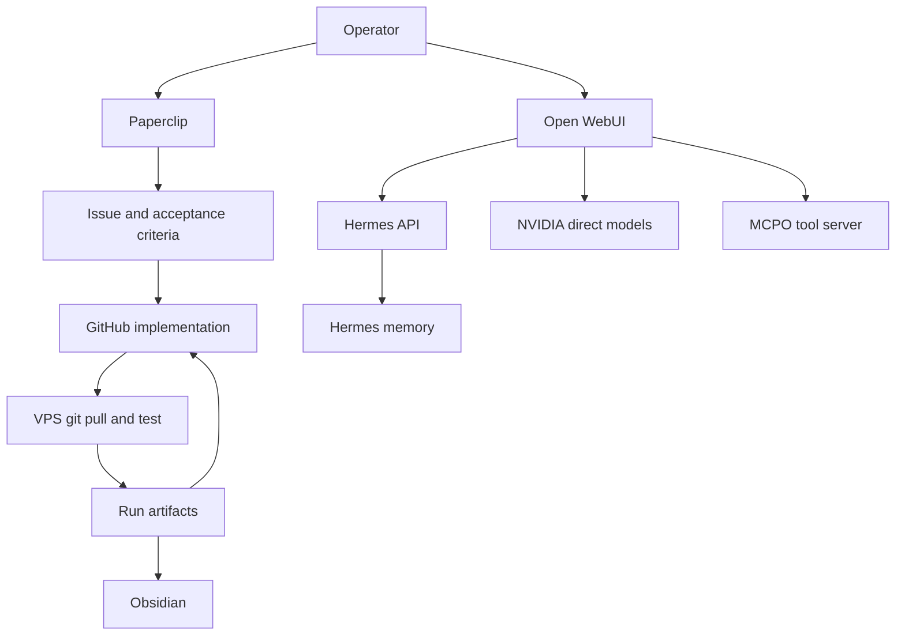

# V1.2 Integration Plan

## Goal

Make the Veloce AI stack usable as one connected operating flow instead of separate working services.

The v1.2 outcome should be:

```text
Paperclip = task board and agent work queue
Open WebUI = operator cockpit
Hermes = memory-capable agent brain
NVIDIA direct = fast model lane
MCPO = Open WebUI tool bridge
GitHub = source of truth for code
VPS = execution host
Obsidian = durable operating memory
```

## Current Problem

The services are running, but they are not yet connected into a daily workflow.

Current reality:

- Paperclip works, but its local Hermes adapter fails.
- Open WebUI works, but it is mostly being used as chat, not as the operator cockpit.
- Hermes works and memory is verified, but Paperclip cannot call it through the broken local adapter.
- MCPO/Ruflo is deferred, so Open WebUI has no useful tool layer yet.
- GitHub and VPS are reliable, but Paperclip agents often cannot write directly to `/root/veloce-research-os`.

## Core Rule

Do not let Paperclip agents directly modify `/root/veloce-research-os`.

Use this flow instead:

```text
1. Paperclip creates issue and desired acceptance criteria.
2. Paperclip may produce design notes or proposed patches.
3. Implementation lands in GitHub from a controlled coding session.
4. VPS pulls from GitHub.
5. VPS verification commands run.
6. Paperclip issue is marked Done with commit hash and verification output.
```

This prevents the repeated blocked state:

```text
agent cannot access /root/veloce-research-os
```

## Integration Flow



## V1.2 Scope

V1.2 should have only three integration tasks.

### Task 1: Paperclip to Hermes HTTP Adapter Design

Purpose:

```text
Replace the broken local Hermes adapter path with an HTTP adapter design.
```

Acceptance:

- Defines request URL.
- Defines auth header.
- Defines request and response format.
- Defines how Paperclip should store the Hermes API key.
- Defines failure modes and retry behavior.
- Does not require the local `hermes` command.

Endpoint:

```text
POST https://hermes.srv1314350.hstgr.cloud/v1/chat/completions
Authorization: Bearer API_SERVER_KEY
Content-Type: application/json
```

Minimum request:

```json
{
  "model": "hermes-agent",
  "messages": [
    {
      "role": "user",
      "content": "Task prompt goes here."
    }
  ]
}
```

### Task 2: Open WebUI Tool Layer with MCPO

Purpose:

```text
Add one working Open WebUI tool server path.
```

Acceptance:

- MCPO container or equivalent is running.
- Open WebUI can load an OpenAPI tool schema.
- One tool can be called from chat.
- Tool server is not exposed directly except through intended HTTPS routing.

Initial tool should be boring and safe:

```text
status_check
```

It should return:

```text
current stack status, git commit, and test command hints
```

Do not start with broad shell execution tools.

### Task 3: Operator Cockpit Workflow

Purpose:

```text
Make Open WebUI useful for operating the system, not just chatting.
```

Acceptance:

- Open WebUI has two clear lanes:
  - `hermes-agent` for memory/agent behavior.
  - direct NVIDIA models for fast responses.
- A pinned operator prompt explains when to use each lane.
- The operator can ask for stack status and receive a tool-backed answer.
- The workflow references GitHub/VPS as source of truth.

## Paperclip Issue Templates

### Issue A

Title:

```text
v1.2A - Design Paperclip to Hermes HTTP adapter
```

Assignee:

```text
Technical Builder
```

Description:

```text
Goal:
Design the HTTP adapter path that lets Paperclip call Hermes without using the broken local hermes command.

Context:
- Hermes standalone is verified.
- Hermes memory persistence is verified.
- Paperclip local Hermes adapter fails because hermes is not in PATH.
- GitHub/VPS are source of truth for code.

Deliver:
1. HTTP request format.
2. Auth and secret handling plan.
3. Response mapping back into Paperclip issue comments.
4. Failure modes and retry behavior.
5. Exact files that would need to change if implemented.
6. Manual curl test command.

Do not modify /root/veloce-research-os directly.
Produce a design artifact only.
Final disposition should be in_review for human implementation.
```

### Issue B

Title:

```text
v1.2B - Design Open WebUI MCPO tool layer
```

Assignee:

```text
Technical Builder
```

Description:

```text
Goal:
Design the minimal MCPO/OpenAPI tool layer for Open WebUI.

Context:
- Open WebUI is running at https://chat.srv1314350.hstgr.cloud.
- MCPO/Ruflo was previously deferred because the Ruflo image was not pullable.
- Start with one safe status_check tool, not broad shell execution.

Deliver:
1. Recommended container/service design.
2. OpenAPI schema path to register in Open WebUI.
3. Tool name and response shape.
4. Docker Compose changes needed.
5. Open WebUI admin setup steps.
6. Security guardrails.
7. Acceptance test.

Do not modify /root/veloce-research-os directly.
Produce a design artifact only.
Final disposition should be in_review for human implementation.
```

### Issue C

Title:

```text
v1.2C - Define Open WebUI operator cockpit workflow
```

Assignee:

```text
Task Manager
```

Description:

```text
Goal:
Define the daily operator workflow for using Open WebUI, Hermes, direct NVIDIA models, Paperclip, GitHub, VPS, and Obsidian together.

Deliver:
1. When to use Open WebUI.
2. When to use Paperclip.
3. When to use Hermes.
4. When to use direct NVIDIA models.
5. How GitHub/VPS verification fits.
6. How Obsidian sync fits.
7. A one-page operator checklist.
8. A pinned Open WebUI system/operator prompt.

Do not create new agents.
Do not add more than one tool server.
Final disposition should be done when the workflow is clear.
```

## Human Implementation Gate

After Issues A, B, and C are complete, the human/Codex coding session should decide what to implement.

Design review:

```text
docs/v1.2-design-review.md
```

Implementation should be one pull request or one small commit series:

```text
1. Add status_check tool server.
2. Add MCPO/OpenAPI wiring if selected.
3. Add Paperclip-to-Hermes adapter only if the design has a clear safe path.
4. Update SYSTEM_STATUS.md.
5. Verify on VPS.
```

## V1.2 Done Definition

V1.2 is done when:

```text
Open WebUI can call at least one tool.
Hermes remains verified for standalone and memory use.
Paperclip has a documented HTTP path to Hermes, or a working HTTP adapter.
The broken local Hermes adapter is no longer part of the recommended flow.
The operator has a one-page checklist for daily use.
SYSTEM_STATUS.md reflects the new state.
```

## Anti-Loop Rules

If Paperclip creates a recovery issue because an agent cannot access `/root/veloce-research-os`:

```text
1. Do not retry the same agent path more than once.
2. Mark the source issue in_review or blocked with clear owner.
3. Implement from Codex/GitHub instead.
4. Pull and verify on VPS.
5. Mark Paperclip issue Done with commit hash.
6. Mark recovery issue Done or Cancelled.
```

If Paperclip says "missing disposition":

```text
The human must set Done, Cancelled, In Review, or Blocked in the UI.
Text saying "final disposition: done" inside a comment is not enough.
```
